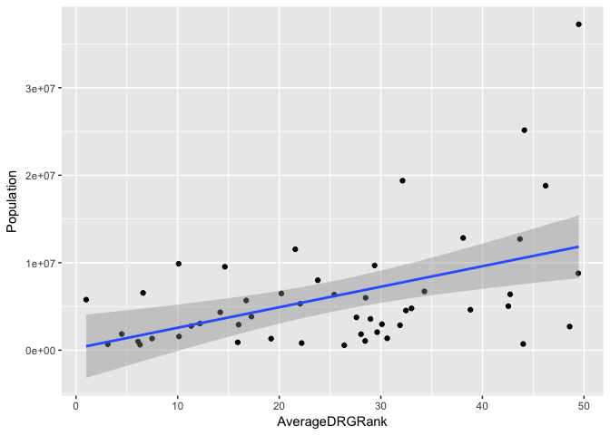
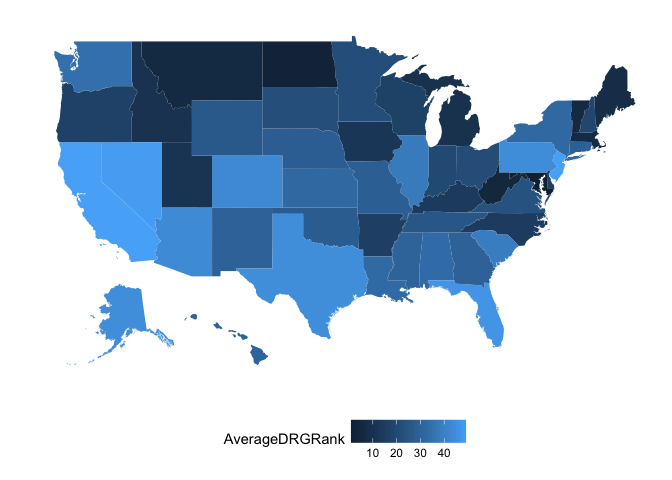

Medicare Provider Summary for the Top 100 Diagnosis-Related Groups (DRG)
================
Connor Duplessis

Introduction
------------

The dataset includes hospital-specific charges for the more than 3,000 U.S. hospitals that receive Medicare Inpatient Prospective Payment System (IPPS) payments for the top 100 most frequently billed discharges, paid under Medicare based on a rate per discharge using the Medicare Severity Diagnosis Related Group (MS-DRG) for Fiscal Year (FY) 2011. These DRGs represent more than 7 million discharges or 60 percent of total Medicare IPPS discharges.The dataset includes 12 variables across 163,065 observations.

The goals of this report are to determine:
Which states on average charge the most and least amounts across all DRG's
If a states population is a good indicator of how much providers charge
If certain area's of the country are more expensive than others

Dataset URL: <https://data.cms.gov/Medicare-Inpatient/Inpatient-Prospective-Payment-System-IPPS-Provider/97k6-zzx3>

Importing and Cleaning
----------------------

``` r
IPPS <- read.csv("IPPS.csv", stringsAsFactors=FALSE)  
library(dplyr)
library(magrittr)
```

We are only going to be looking at a few columns, so I will remove all the unnecessary columns.

``` r
IPPS3 <- IPPS[,-c(2:5, 7:9, 11:12)]
head(IPPS3)
```

    ##                             DRG.Definition Provider.State
    ## 1 039 - EXTRACRANIAL PROCEDURES W/O CC/MCC             AL
    ## 2 039 - EXTRACRANIAL PROCEDURES W/O CC/MCC             AL
    ## 3 039 - EXTRACRANIAL PROCEDURES W/O CC/MCC             AL
    ## 4 039 - EXTRACRANIAL PROCEDURES W/O CC/MCC             AL
    ## 5 039 - EXTRACRANIAL PROCEDURES W/O CC/MCC             AL
    ## 6 039 - EXTRACRANIAL PROCEDURES W/O CC/MCC             AL
    ##   Average.Covered.Charges
    ## 1               $32963.07
    ## 2               $15131.85
    ## 3               $37560.37
    ## 4               $13998.28
    ## 5               $31633.27
    ## 6               $16920.79

We also need to remove the Dollar Signs from the Average.Covered.Charges Column before starting the analysis

``` r
DollarSignRemoved <- gsub('$', '', IPPS3$Average.Covered.Charges, fixed = TRUE)
DollarSignRemoved <- as.numeric(DollarSignRemoved)
IPPS4<- IPPS3[,-3]
IPPS4[,"Average.Covered.Charges"] <- DollarSignRemoved
head(IPPS4)
```

    ##                             DRG.Definition Provider.State
    ## 1 039 - EXTRACRANIAL PROCEDURES W/O CC/MCC             AL
    ## 2 039 - EXTRACRANIAL PROCEDURES W/O CC/MCC             AL
    ## 3 039 - EXTRACRANIAL PROCEDURES W/O CC/MCC             AL
    ## 4 039 - EXTRACRANIAL PROCEDURES W/O CC/MCC             AL
    ## 5 039 - EXTRACRANIAL PROCEDURES W/O CC/MCC             AL
    ## 6 039 - EXTRACRANIAL PROCEDURES W/O CC/MCC             AL
    ##   Average.Covered.Charges
    ## 1                32963.07
    ## 2                15131.85
    ## 3                37560.37
    ## 4                13998.28
    ## 5                31633.27
    ## 6                16920.79

State Rankings
--------------

To determine how states compare against each other on average, we are going to rank them 1-51 (Washington DC is included) for every DRG. Because this dataset contains the top 100 most common DRG's we will have 100 sets of rankings that we can determine each state's average ranking across all DRG's.

``` r
StateAverage <- IPPS4 %>%
  group_by(Provider.State, DRG.Definition) %>%
  mutate(Average = mean(Average.Covered.Charges)) %>%
  distinct(DRG.Definition, Provider.State, .keep_all = TRUE) %>%
  arrange(DRG.Definition, desc(Average))
StateAverage2 <- StateAverage %>%
  group_by(DRG.Definition) %>%
  mutate(DRGRank = rank(Average))
StateRank <- StateAverage2 %>%
  group_by(Provider.State) %>%
  mutate(AverageDRGRank = mean(DRGRank)) %>%
  distinct(AverageDRGRank, .keep_all = TRUE) %>%
  arrange(desc(AverageDRGRank)) %>%
  select(Provider.State, AverageDRGRank)

print(StateRank, n = 51)
```

    ## # A tibble: 51 x 2
    ## # Groups:   Provider.State [51]
    ##    Provider.State AverageDRGRank
    ##             <chr>          <dbl>
    ##  1             CA      49.480000
    ##  2             NJ      49.430000
    ##  3             NV      48.590000
    ##  4             FL      46.220000
    ##  5             TX      44.130000
    ##  6             AK      44.012821
    ##  7             PA      43.690000
    ##  8             AZ      42.730000
    ##  9             CO      42.550000
    ## 10             DC      40.390000
    ## 11             SC      38.820000
    ## 12             IL      38.100000
    ## 13             WA      34.290000
    ## 14             AL      33.020000
    ## 15             LA      32.470000
    ## 16             NY      32.140000
    ## 17             KS      31.890000
    ## 18             HI      30.625000
    ## 19             MS      30.110000
    ## 20             NM      29.640000
    ## 21             GA      29.390000
    ## 22             CT      28.980000
    ## 23             MO      28.500000
    ## 24             RI      28.460000
    ## 25             NE      28.050000
    ## 26             OK      27.600000
    ## 27             WY      26.402299
    ## 28             TN      25.410000
    ## 29             VA      23.800000
    ## 30             SD      22.210000
    ## 31             MN      22.060000
    ## 32             OH      21.580000
    ## 33             IN      20.210000
    ## 34             NH      19.202020
    ## 35             OR      17.262626
    ## 36             WI      16.750000
    ## 37             AR      16.000000
    ## 38             DE      15.920000
    ## 39             NC      14.650000
    ## 40             KY      14.190000
    ## 41             IA      12.190000
    ## 42             UT      11.336735
    ## 43             ID      10.136842
    ## 44             MI      10.100000
    ## 45             ME       7.484848
    ## 46             MA       6.600000
    ## 47             VT       6.297872
    ## 48             MT       6.107527
    ## 49             WV       4.500000
    ## 50             ND       3.126316
    ## 51             MD       1.000000

From this calculation we can see that providers in California on average charge the highest amounts while providers in Maryland charge the least. It seems like the highly populated states fall on the more expensive side of the rankings. Could state population be correlated with how much a provider charges? Let's take a look.

Population vs. Rankings
-----------------------

I pulled state population data from <https://en.wikipedia.org/wiki/List_of_U.S._states_and_territories_by_population>

``` r
library(readxl)
State_Population <- read_excel("State_Population.xls", col_names = FALSE)
head(State_Population)
```

    ## # A tibble: 6 x 2
    ##          X__1     X__2
    ##         <chr>    <dbl>
    ## 1     alabama  4780127
    ## 2      alaska   710249
    ## 3     arizona  6392307
    ## 4    arkansas  2915958
    ## 5  california 37252895
    ## 6    colorado  5029324

We'll need to do some cleaning and manipulating in StateRank before we can join in the population numbers; such as: removing Washington DC, converting State abbreviations into full State names, and ordering alphabetically.

``` r
library(datasets)
StateRankandPop <- StateRank[-10,]

StateNames <- state.name[match(StateRankandPop$Provider.State,state.abb)]

StateRankandPop[,"StateName"] <- StateNames

StateRankandPop <- StateRankandPop  %>%
  arrange(StateName)

head(StateRankandPop)
```

    ## # A tibble: 6 x 3
    ## # Groups:   Provider.State [6]
    ##   Provider.State AverageDRGRank  StateName
    ##            <chr>          <dbl>      <chr>
    ## 1             AL       33.02000    Alabama
    ## 2             AK       44.01282     Alaska
    ## 3             AZ       42.73000    Arizona
    ## 4             AR       16.00000   Arkansas
    ## 5             CA       49.48000 California
    ## 6             CO       42.55000   Colorado

Now we can join in the population numbers

``` r
StateRankandPop[,"Population"] <- State_Population$X__2
head(StateRankandPop)
```

    ## # A tibble: 6 x 4
    ## # Groups:   Provider.State [6]
    ##   Provider.State AverageDRGRank  StateName Population
    ##            <chr>          <dbl>      <chr>      <dbl>
    ## 1             AL       33.02000    Alabama    4780127
    ## 2             AK       44.01282     Alaska     710249
    ## 3             AZ       42.73000    Arizona    6392307
    ## 4             AR       16.00000   Arkansas    2915958
    ## 5             CA       49.48000 California   37252895
    ## 6             CO       42.55000   Colorado    5029324

Now let's plot population against the State's rankings we calculated.

``` r
library(ggplot2)
PopVsDRGRank <- ggplot(StateRankandPop, aes(x = AverageDRGRank, y = Population)) +
  geom_point() +
  geom_smooth(method = "lm")

PopVsDRGRank
```



There seems to be a slight positive correlation between these 2 variables but more analysis would need to be done. What about certain regions of the country being more or less expensive than others? Let's take a look.

State Map
---------

``` r
library(maps)
library(mapproj)
library(mapdata)
library(fiftystater)

StateAverageForMap <- StateRankandPop[,-c(1,4)]

StateNameLower <- tolower(StateAverageForMap$StateName)

StateAverageForMap[,"State"] <- StateNameLower

StateAverageForMap <- StateAverageForMap[,-2]

StateMap <- ggplot(StateAverageForMap, aes(map_id = State)) +
geom_map(aes(fill = AverageDRGRank), map = fifty_states) +
expand_limits(x = fifty_states$long, y = fifty_states$lat) +
coord_map() +
scale_x_continuous(breaks = NULL) +
scale_y_continuous(breaks = NULL) +
labs(x = "", y = "") +
theme(legend.position = "bottom",
panel.background = element_blank())

StateMap
```



From this map it doesn't appear that any particular region of the country is more or less expensive than others.

Conclusion
----------

From this analysis, it appears that state population might be correlated with how much a provider charges. The state map shows that no region is more or less expensive than the rest of the country. Further analysis should be done to explore the data on the city or zip code level.
