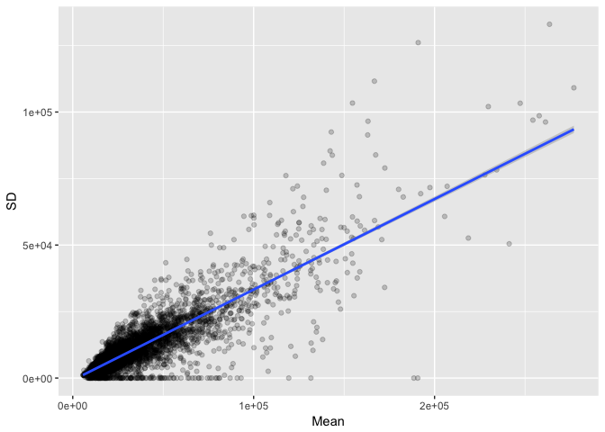
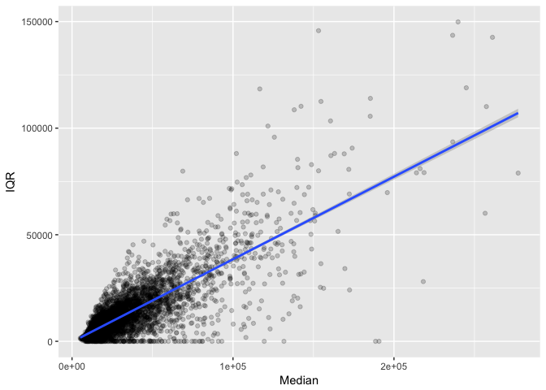
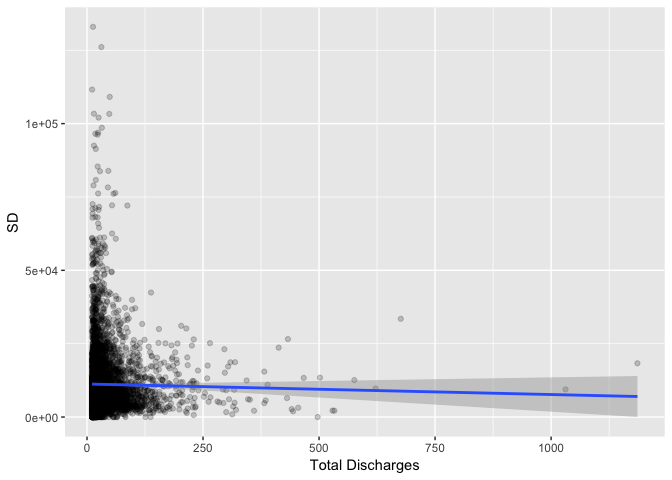

Variation in Medicare Claims
================
Connor Duplessis

This report will focus on quantifying the variability of charges across states and DRG Definitions.

### Read in dataset

``` r
library(tidyverse)
library(kableExtra)
library(knitr)

IPPS <- read_csv("~/Desktop/Connor/Medicare_Analysis/IPPS.csv", 
                 col_types = cols(`Average Covered Charges` = col_number(), 
                                  `Average Medicare Payments` = col_number(), 
                                  `Average Total Payments` = col_number()))
glimpse(IPPS)
```

    ## Observations: 163,065
    ## Variables: 12
    ## $ `DRG Definition`                       <chr> "039 - EXTRACRANIAL PRO...
    ## $ `Provider Id`                          <int> 10001, 10005, 10006, 10...
    ## $ `Provider Name`                        <chr> "SOUTHEAST ALABAMA MEDI...
    ## $ `Provider Street Address`              <chr> "1108 ROSS CLARK CIRCLE...
    ## $ `Provider City`                        <chr> "DOTHAN", "BOAZ", "FLOR...
    ## $ `Provider State`                       <chr> "AL", "AL", "AL", "AL",...
    ## $ `Provider Zip Code`                    <int> 36301, 35957, 35631, 35...
    ## $ `Hospital Referral Region Description` <chr> "AL - Dothan", "AL - Bi...
    ## $ `Total Discharges`                     <int> 91, 14, 24, 25, 18, 67,...
    ## $ `Average Covered Charges`              <dbl> 32963.07, 15131.85, 375...
    ## $ `Average Total Payments`               <dbl> 5777.24, 5787.57, 5434....
    ## $ `Average Medicare Payments`            <dbl> 4763.73, 4976.71, 4453....

### Variation Statistics on DRG's

Here we will calculate the Standard Deviation, Inner Quartile Range (IQR), Mean, and Median of all DRG's across all states.

``` r
DRGVariation <- IPPS %>%
  group_by(`DRG Definition`) %>%
  mutate(SD = sd(`Average Covered Charges`)) %>%
  mutate(IQR = IQR(`Average Covered Charges`)) %>%
  mutate(Mean = mean(`Average Covered Charges`)) %>%
  mutate(Median = median(`Average Covered Charges`)) %>%
  distinct(`DRG Definition`, .keep_all = TRUE) %>%
  arrange(desc(SD)) %>%
  select(`DRG Definition`, `Mean`, `SD`, `IQR`, `Median`)

#10 highest standard deviation#
kable(DRGVariation[1:10,], "html") %>%
  kable_styling(bootstrap_options = c("striped", "hover", "condensed", "responsive"), font_size = 11) %>%
  scroll_box(width = "100%", height = "200px")  
```

<table class="table table-striped table-hover table-condensed table-responsive" style="font-size: 11px; margin-left: auto; margin-right: auto;">
<thead>
<tr>
<th style="text-align:left;">
DRG Definition
</th>
<th style="text-align:right;">
Mean
</th>
<th style="text-align:right;">
SD
</th>
<th style="text-align:right;">
IQR
</th>
<th style="text-align:right;">
Median
</th>
</tr>
</thead>
<tbody>
<tr>
<td style="text-align:left;">
870 - SEPTICEMIA OR SEVERE SEPSIS W MV 96+ HOURS
</td>
<td style="text-align:right;">
163227.33
</td>
<td style="text-align:right;">
90553.99
</td>
<td style="text-align:right;">
101306.57
</td>
<td style="text-align:right;">
140843.59
</td>
</tr>
<tr>
<td style="text-align:left;">
207 - RESPIRATORY SYSTEM DIAGNOSIS W VENTILATOR SUPPORT 96+ HOURS
</td>
<td style="text-align:right;">
143428.05
</td>
<td style="text-align:right;">
84817.42
</td>
<td style="text-align:right;">
82404.88
</td>
<td style="text-align:right;">
122209.07
</td>
</tr>
<tr>
<td style="text-align:left;">
853 - INFECTIOUS & PARASITIC DISEASES W O.R. PROCEDURE W MCC
</td>
<td style="text-align:right;">
139186.35
</td>
<td style="text-align:right;">
78280.14
</td>
<td style="text-align:right;">
85693.30
</td>
<td style="text-align:right;">
119176.52
</td>
</tr>
<tr>
<td style="text-align:left;">
329 - MAJOR SMALL & LARGE BOWEL PROCEDURES W MCC
</td>
<td style="text-align:right;">
135330.94
</td>
<td style="text-align:right;">
73833.90
</td>
<td style="text-align:right;">
79007.41
</td>
<td style="text-align:right;">
115883.21
</td>
</tr>
<tr>
<td style="text-align:left;">
460 - SPINAL FUSION EXCEPT CERVICAL W/O MCC
</td>
<td style="text-align:right;">
95568.28
</td>
<td style="text-align:right;">
47129.77
</td>
<td style="text-align:right;">
53118.76
</td>
<td style="text-align:right;">
85471.48
</td>
</tr>
<tr>
<td style="text-align:left;">
246 - PERC CARDIOVASC PROC W DRUG-ELUTING STENT W MCC OR 4+ VESSELS/STENTS
</td>
<td style="text-align:right;">
96348.81
</td>
<td style="text-align:right;">
42584.85
</td>
<td style="text-align:right;">
52257.63
</td>
<td style="text-align:right;">
84451.65
</td>
</tr>
<tr>
<td style="text-align:left;">
252 - OTHER VASCULAR PROCEDURES W MCC
</td>
<td style="text-align:right;">
83502.96
</td>
<td style="text-align:right;">
41521.31
</td>
<td style="text-align:right;">
47872.22
</td>
<td style="text-align:right;">
74701.40
</td>
</tr>
<tr>
<td style="text-align:left;">
469 - MAJOR JOINT REPLACEMENT OR REATTACHMENT OF LOWER EXTREMITY W MCC
</td>
<td style="text-align:right;">
81704.23
</td>
<td style="text-align:right;">
40188.31
</td>
<td style="text-align:right;">
44598.60
</td>
<td style="text-align:right;">
71600.95
</td>
</tr>
<tr>
<td style="text-align:left;">
480 - HIP & FEMUR PROCEDURES EXCEPT MAJOR JOINT W MCC
</td>
<td style="text-align:right;">
75339.61
</td>
<td style="text-align:right;">
38177.07
</td>
<td style="text-align:right;">
44617.79
</td>
<td style="text-align:right;">
65355.54
</td>
</tr>
<tr>
<td style="text-align:left;">
238 - MAJOR CARDIOVASC PROCEDURES W/O MCC
</td>
<td style="text-align:right;">
85010.45
</td>
<td style="text-align:right;">
35330.83
</td>
<td style="text-align:right;">
41362.19
</td>
<td style="text-align:right;">
77990.39
</td>
</tr>
</tbody>
</table>

``` r
#10 lowest standard deviation#
kable(arrange(tail(DRGVariation, n = 10),SD),"html") %>%
kable_styling(bootstrap_options = c("striped", "hover", "condensed", "responsive"), font_size = 11) %>%
  scroll_box(width = "100%", height = "200px")  
```

<table class="table table-striped table-hover table-condensed table-responsive" style="font-size: 11px; margin-left: auto; margin-right: auto;">
<thead>
<tr>
<th style="text-align:left;">
DRG Definition
</th>
<th style="text-align:right;">
Mean
</th>
<th style="text-align:right;">
SD
</th>
<th style="text-align:right;">
IQR
</th>
<th style="text-align:right;">
Median
</th>
</tr>
</thead>
<tbody>
<tr>
<td style="text-align:left;">
310 - CARDIAC ARRHYTHMIA & CONDUCTION DISORDERS W/O CC/MCC
</td>
<td style="text-align:right;">
14933.90
</td>
<td style="text-align:right;">
8222.580
</td>
<td style="text-align:right;">
8243.375
</td>
<td style="text-align:right;">
12768.08
</td>
</tr>
<tr>
<td style="text-align:left;">
536 - FRACTURES OF HIP & PELVIS W/O MCC
</td>
<td style="text-align:right;">
17482.14
</td>
<td style="text-align:right;">
8759.112
</td>
<td style="text-align:right;">
10048.177
</td>
<td style="text-align:right;">
15143.89
</td>
</tr>
<tr>
<td style="text-align:left;">
305 - HYPERTENSION W/O MCC
</td>
<td style="text-align:right;">
17517.99
</td>
<td style="text-align:right;">
8767.140
</td>
<td style="text-align:right;">
9591.250
</td>
<td style="text-align:right;">
15495.88
</td>
</tr>
<tr>
<td style="text-align:left;">
313 - CHEST PAIN
</td>
<td style="text-align:right;">
16948.32
</td>
<td style="text-align:right;">
9060.080
</td>
<td style="text-align:right;">
9619.985
</td>
<td style="text-align:right;">
14659.60
</td>
</tr>
<tr>
<td style="text-align:left;">
684 - RENAL FAILURE W/O CC/MCC
</td>
<td style="text-align:right;">
17027.83
</td>
<td style="text-align:right;">
9132.723
</td>
<td style="text-align:right;">
9682.545
</td>
<td style="text-align:right;">
14775.47
</td>
</tr>
<tr>
<td style="text-align:left;">
390 - G.I. OBSTRUCTION W/O CC/MCC
</td>
<td style="text-align:right;">
17359.64
</td>
<td style="text-align:right;">
9163.756
</td>
<td style="text-align:right;">
9862.497
</td>
<td style="text-align:right;">
14919.76
</td>
</tr>
<tr>
<td style="text-align:left;">
303 - ATHEROSCLEROSIS W/O MCC
</td>
<td style="text-align:right;">
16640.70
</td>
<td style="text-align:right;">
9193.050
</td>
<td style="text-align:right;">
9608.130
</td>
<td style="text-align:right;">
14120.35
</td>
</tr>
<tr>
<td style="text-align:left;">
301 - PERIPHERAL VASCULAR DISORDERS W/O CC/MCC
</td>
<td style="text-align:right;">
17152.40
</td>
<td style="text-align:right;">
9274.179
</td>
<td style="text-align:right;">
9638.940
</td>
<td style="text-align:right;">
14942.85
</td>
</tr>
<tr>
<td style="text-align:left;">
149 - DYSEQUILIBRIUM
</td>
<td style="text-align:right;">
18870.97
</td>
<td style="text-align:right;">
9492.387
</td>
<td style="text-align:right;">
11001.105
</td>
<td style="text-align:right;">
16491.15
</td>
</tr>
<tr>
<td style="text-align:left;">
641 - MISC DISORDERS OF NUTRITION,METABOLISM,FLUIDS/ELECTROLYTES W/O MCC
</td>
<td style="text-align:right;">
16703.61
</td>
<td style="text-align:right;">
9518.219
</td>
<td style="text-align:right;">
9610.795
</td>
<td style="text-align:right;">
14263.55
</td>
</tr>
</tbody>
</table>

Here we see that the DRG 870- Septicemia has the highest standard deviation at $90,553, while DRG 310- Cardiac Arrhythmia has the lowest at $8,222.

### Variation Statistics on DRG's by State

Let's see which DRG's have the highest and lowest standard deviation when broken out for each state.

``` r
Variation_by_State <- IPPS %>%
  group_by(`DRG Definition`, `Provider State`) %>%
  mutate(SD = sd(`Average Covered Charges`)) %>%
  mutate(IQR = IQR(`Average Covered Charges`)) %>%
  mutate(Mean = mean(`Average Covered Charges`)) %>%
  mutate(Median = median(`Average Covered Charges`)) %>%
  distinct(`DRG Definition`, `Provider State`, .keep_all = TRUE) %>%
  arrange(desc(SD)) %>%
  select(`DRG Definition`, `Provider State`, `Mean`, `SD`, `IQR`, `Median`, `Total Discharges`)

#10 highest standard deviation#
kable(Variation_by_State[1:10,], "html") %>%
  kable_styling(bootstrap_options = c("striped", "hover", "condensed", "responsive"), font_size = 11) %>%
  scroll_box(width = "100%", height = "200px")  
```

<table class="table table-striped table-hover table-condensed table-responsive" style="font-size: 11px; margin-left: auto; margin-right: auto;">
<thead>
<tr>
<th style="text-align:left;">
DRG Definition
</th>
<th style="text-align:left;">
Provider State
</th>
<th style="text-align:right;">
Mean
</th>
<th style="text-align:right;">
SD
</th>
<th style="text-align:right;">
IQR
</th>
<th style="text-align:right;">
Median
</th>
<th style="text-align:right;">
Total Discharges
</th>
</tr>
</thead>
<tbody>
<tr>
<td style="text-align:left;">
207 - RESPIRATORY SYSTEM DIAGNOSIS W VENTILATOR SUPPORT 96+ HOURS
</td>
<td style="text-align:left;">
CA
</td>
<td style="text-align:right;">
263542.5
</td>
<td style="text-align:right;">
132991.91
</td>
<td style="text-align:right;">
149852.67
</td>
<td style="text-align:right;">
239810.0
</td>
<td style="text-align:right;">
13
</td>
</tr>
<tr>
<td style="text-align:left;">
870 - SEPTICEMIA OR SEVERE SEPSIS W MV 96+ HOURS
</td>
<td style="text-align:left;">
PA
</td>
<td style="text-align:right;">
190953.0
</td>
<td style="text-align:right;">
126093.13
</td>
<td style="text-align:right;">
103392.87
</td>
<td style="text-align:right;">
160574.9
</td>
<td style="text-align:right;">
31
</td>
</tr>
<tr>
<td style="text-align:left;">
207 - RESPIRATORY SYSTEM DIAGNOSIS W VENTILATOR SUPPORT 96+ HOURS
</td>
<td style="text-align:left;">
PA
</td>
<td style="text-align:right;">
166742.5
</td>
<td style="text-align:right;">
111601.29
</td>
<td style="text-align:right;">
108622.76
</td>
<td style="text-align:right;">
138036.7
</td>
<td style="text-align:right;">
11
</td>
</tr>
<tr>
<td style="text-align:left;">
870 - SEPTICEMIA OR SEVERE SEPSIS W MV 96+ HOURS
</td>
<td style="text-align:left;">
CA
</td>
<td style="text-align:right;">
277004.6
</td>
<td style="text-align:right;">
109108.30
</td>
<td style="text-align:right;">
142622.01
</td>
<td style="text-align:right;">
261191.9
</td>
<td style="text-align:right;">
49
</td>
</tr>
<tr>
<td style="text-align:left;">
329 - MAJOR SMALL & LARGE BOWEL PROCEDURES W MCC
</td>
<td style="text-align:left;">
PA
</td>
<td style="text-align:right;">
154623.6
</td>
<td style="text-align:right;">
103372.00
</td>
<td style="text-align:right;">
118409.55
</td>
<td style="text-align:right;">
116647.5
</td>
<td style="text-align:right;">
15
</td>
</tr>
<tr>
<td style="text-align:left;">
870 - SEPTICEMIA OR SEVERE SEPSIS W MV 96+ HOURS
</td>
<td style="text-align:left;">
NJ
</td>
<td style="text-align:right;">
247314.0
</td>
<td style="text-align:right;">
103304.89
</td>
<td style="text-align:right;">
79148.37
</td>
<td style="text-align:right;">
218692.8
</td>
<td style="text-align:right;">
48
</td>
</tr>
<tr>
<td style="text-align:left;">
207 - RESPIRATORY SYSTEM DIAGNOSIS W VENTILATOR SUPPORT 96+ HOURS
</td>
<td style="text-align:left;">
NJ
</td>
<td style="text-align:right;">
229715.4
</td>
<td style="text-align:right;">
102051.98
</td>
<td style="text-align:right;">
79049.59
</td>
<td style="text-align:right;">
213967.1
</td>
<td style="text-align:right;">
25
</td>
</tr>
<tr>
<td style="text-align:left;">
853 - INFECTIOUS & PARASITIC DISEASES W O.R. PROCEDURE W MCC
</td>
<td style="text-align:left;">
NV
</td>
<td style="text-align:right;">
257844.6
</td>
<td style="text-align:right;">
98600.76
</td>
<td style="text-align:right;">
78926.99
</td>
<td style="text-align:right;">
277154.0
</td>
<td style="text-align:right;">
32
</td>
</tr>
<tr>
<td style="text-align:left;">
853 - INFECTIOUS & PARASITIC DISEASES W O.R. PROCEDURE W MCC
</td>
<td style="text-align:left;">
CA
</td>
<td style="text-align:right;">
254341.5
</td>
<td style="text-align:right;">
96963.72
</td>
<td style="text-align:right;">
143562.90
</td>
<td style="text-align:right;">
236451.2
</td>
<td style="text-align:right;">
24
</td>
</tr>
<tr>
<td style="text-align:left;">
853 - INFECTIOUS & PARASITIC DISEASES W O.R. PROCEDURE W MCC
</td>
<td style="text-align:left;">
NE
</td>
<td style="text-align:right;">
163205.2
</td>
<td style="text-align:right;">
96540.71
</td>
<td style="text-align:right;">
46267.18
</td>
<td style="text-align:right;">
128091.1
</td>
<td style="text-align:right;">
18
</td>
</tr>
</tbody>
</table>

``` r
#10 lowest standard deviation#
kable(arrange(tail(Variation_by_State, n = 10),SD),"html") %>%
kable_styling(bootstrap_options = c("striped", "hover", "condensed", "responsive"), font_size = 11) %>%
  scroll_box(width = "100%", height = "200px")  
```

<table class="table table-striped table-hover table-condensed table-responsive" style="font-size: 11px; margin-left: auto; margin-right: auto;">
<thead>
<tr>
<th style="text-align:left;">
DRG Definition
</th>
<th style="text-align:left;">
Provider State
</th>
<th style="text-align:right;">
Mean
</th>
<th style="text-align:right;">
SD
</th>
<th style="text-align:right;">
IQR
</th>
<th style="text-align:right;">
Median
</th>
<th style="text-align:right;">
Total Discharges
</th>
</tr>
</thead>
<tbody>
<tr>
<td style="text-align:left;">
897 - ALCOHOL/DRUG ABUSE OR DEPENDENCE W/O REHABILITATION THERAPY W/O MCC
</td>
<td style="text-align:left;">
WY
</td>
<td style="text-align:right;">
16873.64
</td>
<td style="text-align:right;">
NA
</td>
<td style="text-align:right;">
0
</td>
<td style="text-align:right;">
16873.64
</td>
<td style="text-align:right;">
14
</td>
</tr>
<tr>
<td style="text-align:left;">
917 - POISONING & TOXIC EFFECTS OF DRUGS W MCC
</td>
<td style="text-align:left;">
DC
</td>
<td style="text-align:right;">
36324.86
</td>
<td style="text-align:right;">
NA
</td>
<td style="text-align:right;">
0
</td>
<td style="text-align:right;">
36324.86
</td>
<td style="text-align:right;">
23
</td>
</tr>
<tr>
<td style="text-align:left;">
917 - POISONING & TOXIC EFFECTS OF DRUGS W MCC
</td>
<td style="text-align:left;">
HI
</td>
<td style="text-align:right;">
52904.28
</td>
<td style="text-align:right;">
NA
</td>
<td style="text-align:right;">
0
</td>
<td style="text-align:right;">
52904.28
</td>
<td style="text-align:right;">
14
</td>
</tr>
<tr>
<td style="text-align:left;">
917 - POISONING & TOXIC EFFECTS OF DRUGS W MCC
</td>
<td style="text-align:left;">
ND
</td>
<td style="text-align:right;">
25534.75
</td>
<td style="text-align:right;">
NA
</td>
<td style="text-align:right;">
0
</td>
<td style="text-align:right;">
25534.75
</td>
<td style="text-align:right;">
12
</td>
</tr>
<tr>
<td style="text-align:left;">
917 - POISONING & TOXIC EFFECTS OF DRUGS W MCC
</td>
<td style="text-align:left;">
SD
</td>
<td style="text-align:right;">
48169.09
</td>
<td style="text-align:right;">
NA
</td>
<td style="text-align:right;">
0
</td>
<td style="text-align:right;">
48169.09
</td>
<td style="text-align:right;">
11
</td>
</tr>
<tr>
<td style="text-align:left;">
917 - POISONING & TOXIC EFFECTS OF DRUGS W MCC
</td>
<td style="text-align:left;">
VT
</td>
<td style="text-align:right;">
26215.22
</td>
<td style="text-align:right;">
NA
</td>
<td style="text-align:right;">
0
</td>
<td style="text-align:right;">
26215.22
</td>
<td style="text-align:right;">
18
</td>
</tr>
<tr>
<td style="text-align:left;">
917 - POISONING & TOXIC EFFECTS OF DRUGS W MCC
</td>
<td style="text-align:left;">
WY
</td>
<td style="text-align:right;">
32190.16
</td>
<td style="text-align:right;">
NA
</td>
<td style="text-align:right;">
0
</td>
<td style="text-align:right;">
32190.16
</td>
<td style="text-align:right;">
12
</td>
</tr>
<tr>
<td style="text-align:left;">
918 - POISONING & TOXIC EFFECTS OF DRUGS W/O MCC
</td>
<td style="text-align:left;">
AK
</td>
<td style="text-align:right;">
27203.30
</td>
<td style="text-align:right;">
NA
</td>
<td style="text-align:right;">
0
</td>
<td style="text-align:right;">
27203.30
</td>
<td style="text-align:right;">
30
</td>
</tr>
<tr>
<td style="text-align:left;">
918 - POISONING & TOXIC EFFECTS OF DRUGS W/O MCC
</td>
<td style="text-align:left;">
HI
</td>
<td style="text-align:right;">
15185.30
</td>
<td style="text-align:right;">
NA
</td>
<td style="text-align:right;">
0
</td>
<td style="text-align:right;">
15185.30
</td>
<td style="text-align:right;">
13
</td>
</tr>
<tr>
<td style="text-align:left;">
918 - POISONING & TOXIC EFFECTS OF DRUGS W/O MCC
</td>
<td style="text-align:left;">
ND
</td>
<td style="text-align:right;">
7874.29
</td>
<td style="text-align:right;">
NA
</td>
<td style="text-align:right;">
0
</td>
<td style="text-align:right;">
7874.29
</td>
<td style="text-align:right;">
17
</td>
</tr>
</tbody>
</table>

In this subset of the data we see even more variability. Respitory System Diagnosis (DRG 207) in California comes in with the highest standard deviation of $132,991. There are also standard deviations of zero and NA. These observations represent State's that only had one facility submit claims for that DRG. Let's coerce all the NA's to zeros.

``` r
# Coerce NA's on SD and IQR to 0 #
Variation_by_State[is.na(Variation_by_State)] <- 0
```

### Standard deviation against mean, IQR against median

Let's see how correlated standard deviation is to the mean and IQR to the median.

``` r
# Plot SD against mean #
Mean_SD <- ggplot(Variation_by_State, aes(x = Mean, y = SD)) +
  geom_point(alpha = 0.2) +
  geom_smooth(method = "lm")
Mean_SD
```



``` r
# Compute correlation between mean and Standard Deviation #
cor(Variation_by_State$Mean, Variation_by_State$SD)
```

    ## [1] 0.8560965

``` r
# Plot IQR against median #
Median_IQR <- ggplot(Variation_by_State, aes(x = Median, y = IQR)) +
  geom_point(alpha = 0.2) +
  geom_smooth(method = "lm")
Median_IQR
```



``` r
# Compute correlation between median and IQR #
cor(Variation_by_State$Median, Variation_by_State$IQR)
```

    ## [1] 0.7967841

Here, we can see that standard deviation is highly correlated to the mean as well as IQR to the median. To adjust for this effect, let's calculate the coefficient of variation to determine which State/DRG combination's have the highest standard deviation as a percentage of the mean.

``` r
# Add coefficient of variation to Variation_by_State #
Variation_by_State2 <- Variation_by_State %>%
  mutate(CV = (SD/Mean) *100) %>%
  select(`DRG Definition`, CV) %>%
  arrange(desc(CV))
```

    ## Adding missing grouping variables: `Provider State`

``` r
kable(Variation_by_State2[1:10,],"html") %>%
kable_styling(bootstrap_options = c("striped", "hover", "condensed", "responsive"), font_size = 11) %>%
  scroll_box(width = "100%", height = "200px")  
```

<table class="table table-striped table-hover table-condensed table-responsive" style="font-size: 11px; margin-left: auto; margin-right: auto;">
<thead>
<tr>
<th style="text-align:left;">
Provider State
</th>
<th style="text-align:left;">
DRG Definition
</th>
<th style="text-align:right;">
CV
</th>
</tr>
</thead>
<tbody>
<tr>
<td style="text-align:left;">
AL
</td>
<td style="text-align:left;">
698 - OTHER KIDNEY & URINARY TRACT DIAGNOSES W MCC
</td>
<td style="text-align:right;">
87.43621
</td>
</tr>
<tr>
<td style="text-align:left;">
PA
</td>
<td style="text-align:left;">
064 - INTRACRANIAL HEMORRHAGE OR CEREBRAL INFARCTION W MCC
</td>
<td style="text-align:right;">
84.35909
</td>
</tr>
<tr>
<td style="text-align:left;">
NM
</td>
<td style="text-align:left;">
885 - PSYCHOSES
</td>
<td style="text-align:right;">
83.27071
</td>
</tr>
<tr>
<td style="text-align:left;">
PA
</td>
<td style="text-align:left;">
189 - PULMONARY EDEMA & RESPIRATORY FAILURE
</td>
<td style="text-align:right;">
81.42167
</td>
</tr>
<tr>
<td style="text-align:left;">
DC
</td>
<td style="text-align:left;">
897 - ALCOHOL/DRUG ABUSE OR DEPENDENCE W/O REHABILITATION THERAPY W/O MCC
</td>
<td style="text-align:right;">
81.40422
</td>
</tr>
<tr>
<td style="text-align:left;">
AL
</td>
<td style="text-align:left;">
602 - CELLULITIS W MCC
</td>
<td style="text-align:right;">
81.11883
</td>
</tr>
<tr>
<td style="text-align:left;">
VA
</td>
<td style="text-align:left;">
315 - OTHER CIRCULATORY SYSTEM DIAGNOSES W CC
</td>
<td style="text-align:right;">
77.82537
</td>
</tr>
<tr>
<td style="text-align:left;">
AR
</td>
<td style="text-align:left;">
372 - MAJOR GASTROINTESTINAL DISORDERS & PERITONEAL INFECTIONS W CC
</td>
<td style="text-align:right;">
77.01451
</td>
</tr>
<tr>
<td style="text-align:left;">
PA
</td>
<td style="text-align:left;">
871 - SEPTICEMIA OR SEVERE SEPSIS W/O MV 96+ HOURS W MCC
</td>
<td style="text-align:right;">
76.21148
</td>
</tr>
<tr>
<td style="text-align:left;">
PA
</td>
<td style="text-align:left;">
280 - ACUTE MYOCARDIAL INFARCTION, DISCHARGED ALIVE W MCC
</td>
<td style="text-align:right;">
75.15331
</td>
</tr>
</tbody>
</table>

Here we can see that the highest coefficient of variation is Other Kidney & Urinary Tract Diagnoses in Alabama at 87.44. In other words, the standard deviation is roughly 87% of the mean charge.
Could the number of discharges for a DRG be correlated with it's standard deviation? Let's see.

``` r
Discharges_SD <- ggplot(Variation_by_State, aes(x = `Total Discharges`, y = `SD`)) +
  geom_point(alpha = 0.2) +
  geom_smooth(method = "lm")
Discharges_SD
```



``` r
cor(Variation_by_State$`Total Discharges`, Variation_by_State$SD)
```

    ## [1] -0.01633837

It appears that the number of discharges is not correlated with the standard deviation.
